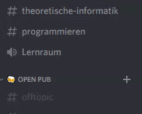

# 🚧 WIP: Voice Channels as a Service

In other words: the bot creates voice channels for you on demand.

## Features
- [x] Creates channels
- [x] Purges empty channels
- [ ] Can be used for many servers simultanourly (multi-tenancy)

---

## Install
TODO

## Configuration
TODO

---

## Build
TODO

## Contribute
TODO