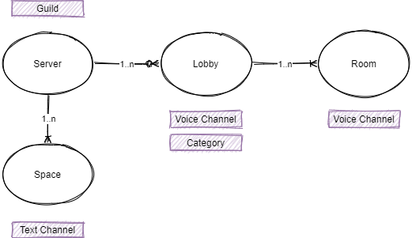

# Terminology

## Server
A server represents a Discord Guild and has several lobbies.

## Lobby
A lobby allows users to create rooms. Rooms are grouped by lobby. 

## Room
A room is a voice channel requested by a user.

## Space
A space is a temporary private text channel created by a user. A space can only be accessed by the users defined by the creator.

# Models
